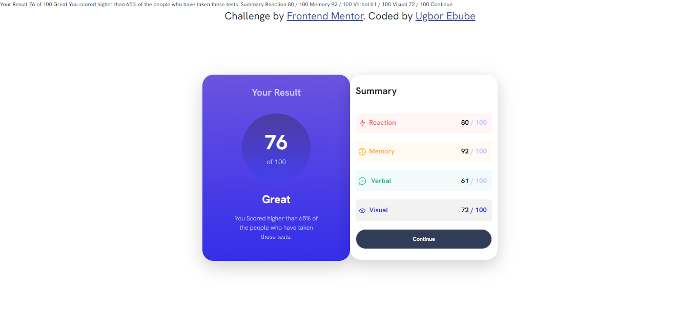

# Frontend Mentor - Results summary component solution

This is a solution to the [Results summary component challenge on Frontend Mentor](https://www.frontendmentor.io/challenges/results-summary-component-CE_K6s0maV). Frontend Mentor challenges help you improve your coding skills by building realistic projects.

## Table of contents

- [Overview](#overview)
  - [The challenge](#the-challenge)
  - [Screenshot](#screenshot)
  - [Links](#links)
- [My process](#my-process)
  - [Built with](#built-with)
- [Author](#author)

## Overview

Result Summary Component
The Result Summary Component is a lightweight HTML and CSS module designed to display summarized information or outcomes in a visually appealing and user-friendly manner. This component is perfect for showcasing key results, statistics, or any other data that requires a concise presentation on your website or web application.

Features

1. Clean and Minimalistic Design: The component features a clean and intuitive design that ensures the information is presented clearly and effectively.

2. Responsive: The component is built to be responsive, ensuring that it adapts to different screen sizes and devices, providing a consistent user experience across platforms.

3. Easy Integration: Adding the Result Summary Component to your website is straightforward. Simply include the HTML and CSS files, and you're ready to use it to display your data summaries.

Example
You can see a live example of the Result Summary Component in action here.

License
This project is open-source and available under the MIT License.

Contribution
We welcome contributions from the community! If you have ideas for improvements or encounter any issues, please feel free to open an issue or submit a pull request.

Feel free to replace placeholders like "path-to-your-stylesheet" and "link-to-live-demo" with the actual paths and links as needed. This overview provides a quick introduction to your Result Summary Component, its features, and how to use it.

### The challenge

Users should be able to:

- View the optimal layout for the interface depending on their device's screen size
- See hover and focus states for all interactive elements on the page

### Screenshot

### Links

- Live Site URL: [Add live site URL here](https://your-live-site-url.com)

## My process

The process of creating a Result Summary Component involves planning its purpose and design, setting up project files (HTML, CSS), designing the HTML structure, styling it with CSS, optionally using JavaScript to fetch and populate data dynamically, testing for compatibility and responsiveness, documenting usage instructions in the README, and optionally sharing the component through publishing methods like hosting or code-sharing platforms.

### Built with

- Semantic HTML5 markup
- CSS custom properties
- Flexbox
- CSS Grid
- Mobile-first workflow
- [Bootstrap](https://getbootstrap.com/docs/5.3/getting-started/introduction/) - HTML, CSS AND JS library

## Author

- Website - [Ugbor Ebube](https://www.your-site.com)
- Frontend Mentor - [@3bube](https://www.frontendmentor.io/profile/3bube)
- Twitter - [@UgborEbube](https://twitter.com/UgborEbube)
